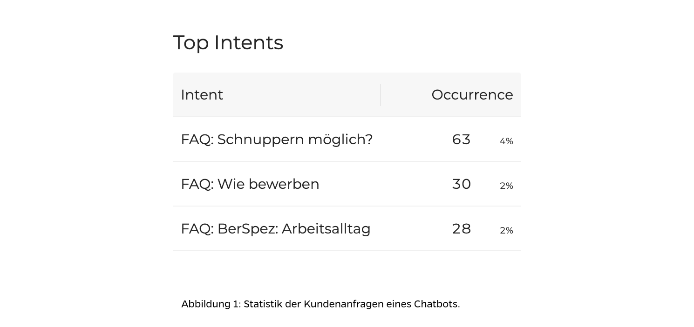

## Verstehen, was der Kunden will

Der erste Schritt, um ein Unternehmen zu verbessern, ist zu verstehen, was die Kunden vom Unternehmen wollen. Das schreibt John Seddon im Buch *Freedom from Command and Control*. John Seddon ist Unternehmensberater und hilft Unternehmen die Prozesse zu optimieren. Erst mit dem Verständnis der Kundenbedürfnisse ist es möglich zu verstehen, in welche Richtung das Unternehmen verbessert werden soll.

Mit den gängigen Kanälen sollte es nicht so schwierig sein, die Kundenbedürfnisse zu kennen. Oder nicht? Doch wenn man es sich kurz überlegt, ist es doch nicht so einfach. Die heutigen Kanälen eines gängigen Unternehmens sind in der Regel: Telefon, Email und eine Webseite. Von der Webseite die Kundenbedürfnisse abzuleiten ist nicht einfach oder gar unmöglich. Beim Mail können einzelne Probleme oder Wünsche erkannt werden, aber zu sagen, dass es bei 13% der Anfragen um ein spezifisches Bedürfnis geht oder aktuelle Bedürfnisse zu entdecken ist nicht einfach. Beim Telefon ist es noch schwieriger, Tendenzen zu entdecken.

## Chatbot hilft Bedürfnisse der Kunden zu kennen

Mit einem Chatbot weiss ein Unternehmen ganz genau, was die Kunden bewegt. Es kann ganz genau aufzeigt werden, welche Themen von Kunden angefragt werden und welche Themen nicht relevant sind. Zudem können neue Bedürfnisse aufgedeckt und schnell in die Kompetenzen des Chatbots aufgenommen werden.

So auch nach der Einführung des Chatbot bei der Suva: Ein paar Tage nach der Einführung stellt sich heraus, dass viele Anfragen zum Thema "Schwangerschaft" gestellt wurden. Selbst dem Kundendienst war nicht bewusst, dass dies ein solch relevantes Thema war. Unmittelbar nach dieser Erkenntnis wurde das Thema Schwangerschaft in die Kompetenzen des Chatbots aufgenommen und es wurde auch überlegt eine spezielle Landingpage diesem Thema zu widmen.

## Mit einem Chatbot doppelt profitieren

Mit einem Chatbot hat ein Unternehmen nicht bloss beim Kundendienst oder Verkauf Vorteile. Ein Unternehmen mit einem Chatbot lernt sehr präzise und schnell, was die Kunden wollen. Somit profitiert ein Unternehmen gleich doppelt, mit dem Einsatz eines Chatbots.

Nach einem kurzen Chat, Mail oder Telefonat, helfen wir von der Botfabrik gerne, die unterschiedlichen potentiale von Chatbots auszuschöpfen.
