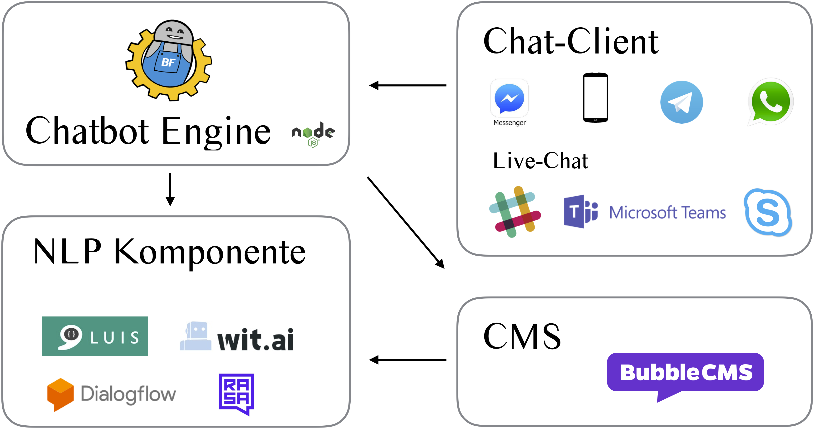
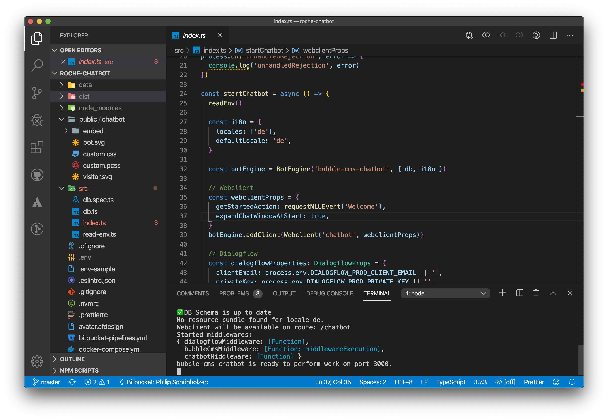

Aus welchen Teilen besteht ein Chatbot? Wie funktionieren diese zusammen? Wie wird ein Chatbot von Grund auf aufgebaut? Diese Fragen wollen wir hier beantworten.

## Bestandteile eines Chatbots

Ein Chatbot besteht aus den folgenden Teilen:

### Client

Der Client ist für das Verschicken und Empfangen von Nachrichten aus der Sicht des Anwenders zuständig. Dies ist auch die einzige Komponente eines Chatbot, welche die Anwender sehen.

Einige Chatbots verwenden bestehende Messaging-Plattformen als Client, wie z.B. den Facebook-Messenger, WhatsApp oder Slack. Dies ist aus verschiedenen Gründen interessant. Zum einen können die Anwender einen bekannten Kanal nutzen. Zum anderen ist es nur so möglich, dass der Chatbot das Gespräch initiiert.

In anderen Fällen wird eine dedizierter Client verwendet. Dies heisst, der Client wurde für den Chatbot entwickelt oder ist Teil des Chatbots. Dies ist meistens der Fall, wenn der Chatbot auf einer Webseite integriert werden soll.

In beiden Fällen hat der Client die selbe Aufgabe: Er ermöglicht es dem Benutzer einen Text zu schreiben oder zu sprechen. Dieser Text wird an einen Server geschickt. Der Server schickt daraufhin eine möglichst passenden Text zurück an den Client, welcher der Client anzeigt.

### Chatbot-Engine

Die Chatbot-Engine ist das Herzstück eines Chatbots. Die Chatbot-Engine hat folgende Aufgaben:

- **Nachrichten senden und empfangen.** Die Engine empfängt von und schickt Nachrichten an die Client. Eine gute Engine ist dabei in der Lage, mit unterschiedlichen Clients (gleichzeitig) zu kommunizieren.
- **Nachrichten verarbeiten.** In der Engine wird entschieden, was mit einer Nachricht geschehen soll und wie auf die Nachricht geantwortet werden soll. Dafür wird eine Engine häufig auch andere Komponenten anfragen, wie z.B. eine Sprachverarbeitung.
- **Die Sitzungen verwalten.** Die Engine muss schauen, dass die richtigen Anwender die richtigen Antworten erhalten oder die gewünschte Aktionen ausgeführt werden. Teilweise muss die Engine auch die Anwender identifizieren, um korrekt zu reagieren oder ev. gewisse Aktionen gar nicht zu erlauben.
- **Kontext merken.** Ein guter Chatbot antwortet je nach Kontext nicht immer gleich. Wenn der Chatbot im Verlauf des Gesprächs beispielsweise bereits einmal erfahren hat, dass der Anwender an der Informatiker-Lehre interessiert ist, so kann er bei der späteren Frage "Was sind die Anforderungen?" gleich vom Kontext Informatiker-Lehre ausgehen und entsprechend antworten. Teilweise werden solche aufgaben auch von einer NLP-Komponenten übernommen (siehe unten).
- **Live-Chat vermitteln.** Soll eine Person das Antworten für den Chatbot übernehmen (Live-Chat), so muss die Chatbot-Engine dies koordinieren. Einerseits muss die Engine das Handover (Übergabe) von der Maschine an den Menschen und somit die Kommunikation zwischen den Clients zu sicherstellen. Andererseits muss sich die Engine den Zustand des Live-Chats für jeden Anwender merken, um die Nachrichten korrekt zu verarbeiten.

### Integration in Umsysteme

Gute Chatbots geben nicht nur statisch Antwort sondern können aktuelle Informationen wiedergeben. Ein klassisches Beispiel ist das Wetter. Damit der Chatbot sagen kann wie das Wetter morgen sein wird, muss dieser einen Wetter-Dienst anfragen. Chatbots die auf Unternehmens-Webseiten angezeigt werden, können ganz unterschiedliche Informationen aus Umsystemen beziehen oder zurückschreiben: Status einer Bestellung, Passwort zurücksetzen, Artikel kaufen usw. Diese Integration wird in den meisten Fällen manuell programmiert. Integrationen die häufiger vorkommen (wie z.B. der Versand eines Emails), müssen aber bloss konfiguriert werden.

### NLP

NLP steht für Natural Language Processing (Sprachverarbeitung). Dies wird manchmal auch als NLU (Natural Language Understanding) beschrieben. Dabei geht es grundsätzlich darum Nachrichten einer Absicht zuzuweisen. Diese Absichten werden im Voraus erfasst und mit Trainingssätzen und teilweise mit Antworten versehen. Schreibt ein Anwender beispielsweise "Ich hätte gerne eine Pizza" so interpretiert eine gut trainierte NLP-Komponente diesen Text als "Absicht: Pizza bestellen; Antwort: Sehr gerne! Wohin soll ich die Pizza liefern?".

Zusätzlich zur Absichtserkennung, wird NLP für weitere aber weniger häufige Aufgaben verwendet. Diese sind Entitätserkennung und teilweise auch Slotfilling und Kontextverarbeitung. Details dazu haben wir im Artikel [Konversationsstränge](https://www.botfabrik.ch/2018/12/17/chatbot-konversationsstraenge-wie-geht-denn-das/) beschrieben.

Nicht jeder Chatbot verwendet NLP. Falls der Chatbot "nur" vorgefertigte Fragen zulässt (Klickbot), so ist NLP nicht nötig. NLP ist nur notwendig, wenn die Anwender frei Text eingeben können.

### CMS

Ähnlich wie bei Webseiten, ist es sinnvoll die Chatbot-Inhalte in einem CMS (Content Management System) zu verwalten. Das CMS enthält dabei alle Absichten, Trainingssätze, Antworten und teilweise auch die Aktionen des Chatbots.

Häufig werden die Inhalte nicht in einem CMS, sondern direkt in einem Chatbot-Tool oder der NLP-Komponente verwaltet. Das Verwalten der Inhalte in einem CMS hat aber viele Vorteile, weshalb wir den Einsatz eins CMSs bevorzugen: Weil die Bedienung sehr einfach und die Daten gesichtert sind, können die Inhalte können direkt von den Mitarbeitern der Fachabteilung gepflegt werden (z.B. Support). Zudem können die Daten unabhängig vom Chatbot-Tool oder der NLP-Komponente gehalten werden, womit man die Hoheit über die Inhalte behält und jederzeit die Tools austauschen kann.

## Entwicklung eines Chatbots

Die Entwicklung eines individuellen Chatbots läuft in der Regel folgendermassen ab.

### Chatbot-Engine aufsetzen

Beim Aufsetzen der Chatbot-Engine werden viele der anderen Teil konfiguriert: Welche Clients sollen für die Kommunikation verwendet werden, ob und welche NLP-Komponente eingesetzt wird, ob und wie Live-Chat funktionieren soll, woher die Inhalte kommen und wie die Umsystem integriert werden. Unsere Chatbot-Engine läuft auf Node.js. Entsprechend Konfigurieren wir die Engine in TypeScript, einer typisierten Variante von JavaScript. Die konfigurierte Engine wird schliesslich auf einem Server bereitgestellt.

### NLP Konfigurieren

Bei Chatbots die NLP verwenden, müssen wir die Komponente ebenfalls aufsetzen. Dies bedeutet einerseits ein neues Projekt auf Dialogflow mit den entsprechenden Tokens für den Zugriff der Engine erstellen.

### Client(s) anpassen

Je nach dem auf welchen Clients der Chatbot erreichbar ist, werden diese ebenfalls aufgesetzt. Im Fall eines Web-Projektes werden zumindest die Farben des Clients an die Webseite angepasst. Im Fall von Facebook-Messenger, muss auf Facebook eine neue Applikation erfasst und die entsprechenden Tokens verlanget werden.

### CMS aufsetzen

Werden für die Inhalte des Chatbots ein CMS verwendet, so wird das CMS einerseits installiert und in der Engine konfiguriert. Die Engine muss vom CMS wissen, damit die Inhalte beim Verarbeiten der Nachrichten aus dem CMS genommen werden.

### Spezielle Logik

Teilweise bietet ein Chatbot spezielle Logik an, wie z.B. ein Gewinnspiel. Die Logik des Spiels wird dabei direkt im Code via Middleware der Engine in TypeScript geschrieben.

### Integrationen sicherstellen

Verwendet ein Chatbot andere Systeme, so wird die Integration mittels Middleware in der Engine programmiert. Diese wird ebenfalls in TypeScript implementiert. Die Möglichkeiten sind nahezu unbegrenzt, solange der Zugriff auf andere System möglich ist.

### Inhalte erfassen

Sobald das CMS läuft, können die Inhalte darin erfasst werden. Dies kann als einziger Schritt auch vom Chatbot-Kunden übernommen werden. Teil der Inhalte sind auch die Trainingssätze. Diese werden während der Entwicklung, aber auch nach dem Publizieren laufend verbessert. Diesem Vorgang wird auch "Trainieren" gesagt.

### Chatbot publizieren

Wenn der Chatbot die gewünschte Qualität erreicht hat, gilt es den Chatbot zu publizieren. Dies geschieht indem der Client entweder auf der Webseite eingebunden wird oder beim der Messaging-Plattform veröffentlicht wird.

## Chatbot von Grund auf entwickeln

Wie eben beschrieben, kann die Entwicklung eines Chatbots von Grund auf recht umfangreich wirken. Dies hängt aber sehr stark von der Grösse und den Fähigkeiten des Chatbots ab. Einen einfacher Chatbot z.B. für ein Gewinnspiel ist bereits nach wenigen Tagen einsatzbereit. Bei einem sehr umfangreichen Chatbot mit vielen Absichten und Schnittstellen kann die Entwicklung aber durchaus auch mehrere Monate in Anspruch nehmen. Natürlich ist der riesige Vorteil einer Entwicklung von Grund auf die maximale Flexibilität und Möglichkeit praktisch alle Wünsche umsetzen zu können.
