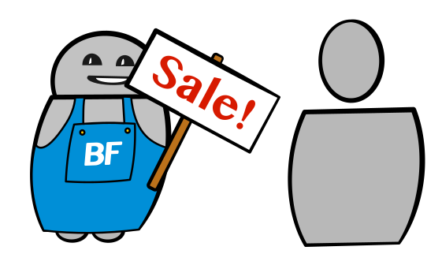

Der Akquise Bot gewinnt für Dich neue Kunden. So begrüsst er Besucher aktiv und versucht diese in der Kaufentscheidung zu unterstützen.

## Mögliche Einsatzgebiete

- Webseitenbesucher begrüssen und Unterstützung anbieten
- Personen in der Nähe des Geschäfts im Chat ansprechen
- Im optimalen Moment mit Leads Kontakt aufnehmen (Tiefpreis, Verbrauchsmaterial, usw.)
