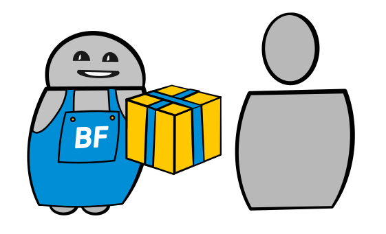

Mit dem Bestell- und Postsales Bot kann man direkt in der Chat Applikation einkaufen und bezahlen. Der Bot nimmt die Bestellung auf und schlägt weitere passende Produkte vor. Mit dem Versand wird der Kunde über den Stand der Lieferung auf dem Laufenden gehalten. Mit der Ankunft der Lieferung bietet der Bot Unterstützung bei Reklamationen und Rücksendungen an. Zudem empfehlt er dem Kunden zum richtigen Zeitpunkt neue Produkte.

## Mögliche Einsatzgebiete

- Pizza bestellen und bezahlen
- Essen im Takeaway bestellen und bezahlen
- Lieferung verfolgen
- Upselling
- Reklamationen behandeln (Rücksendungen)
- Spätere zusätzliche Verkäufe aufgrund von vorhergehenden Einkäufen
