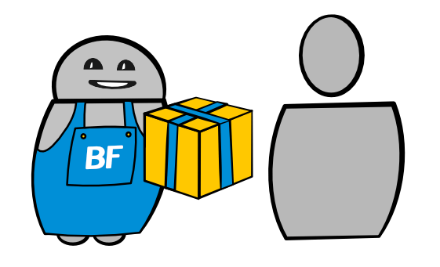
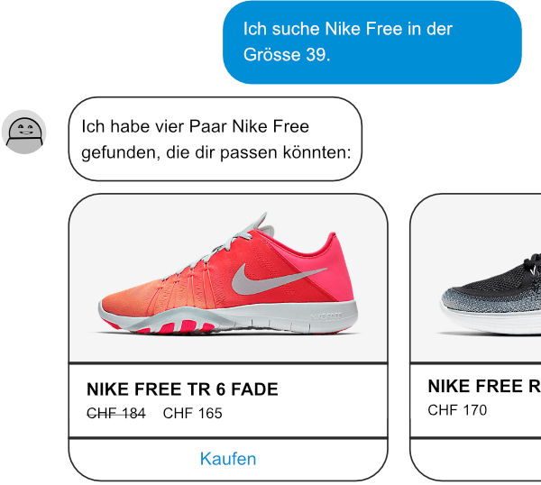

Unser E-Commerce Bot eignet sich für Betreiber von Webshops und Webseiten, welche das Ziel haben, ihren Besuchern etwas zu verkaufen oder diese zu identifizieren.

Wenn Besucher auf deine Website kommen, wollen sie Antworten auf deine Produkte oder Dienstleistungen. Wenn sie diese Antworten nicht finden können, kommen sie vielleicht nie wieder. Hier können dir Chatbots deinen Tag retten.

> ## Kurz erklärt, was unser E-Commerce Bot kann
>
> ### Beratung
>
> Der Bot hilft aus einer grossen Auswahl das richtige Produkt zu finden.
>
> ### Conversion-Steigerung
>
> Der Bot bahnt die Conversion an und führt gezielt zum Abschluss.
>
> ### Bestellungen generieren
>
> Der Bot kann einfache Produkte direkt verkaufen oder Termine vereinbaren.
>
> ### Zusatzverkäufe
>
> Der Bot schlägt passende Zusatzprodukte vor und erklärt deren Vorteile.
>
> ### Identifizierung
>
> Der Bot unterstützt Informations-Suchende und identifiziert diese für die Nachverfolgung der Leads.

## Verkaufsberatung wie im Schuhladen

E-Commerce Bots beraten Kunden als ob sie in einem physischen Lokal einkaufen würden.

Bots bieten dir viele Möglichkeiten, den Erfolg deiner Webseite zu steigern. Lass dich von den folgenden Beispielen inspirieren:

### Beratung in Online Shops durch Bots

Ein oft gehörter Vorbehalt gegenüber Online-Shops ist die fehlende Beratung: Der E-Commerce Bot räumt diesen Nachteil aus dem Weg. Er kann das Bedürfnis des Besuchers durch gezielte Fragen eruieren. Dazu kann der Bot auch bereits vordefinierte Antworten zur Auswahl anbieten. Darauf basierend kann er die passenden Produkte vorschlagen. Er zeigt Unterschiede auf und berät den Kunden bei der Auswahl. Je mehr Facetten Produkte haben und je anspruchsvoller es für den Laien ist, das richtige Produkt zu identifizieren, desto grösser ist der Erfolg des Bots. Er verkürzt den Suchprozess, schränkt die Auswahl auf relevante Produkte ein und gibt dem Nutzer die Sicherheit, das Richtige zu kaufen.

### Conversion-Steigerung dank Bots

Allein schon die Beratung durch den E-Commerce Bot steigert die Conversion. Ein Besucher, der sich sicher ist, das richtige Produkt gewählt zu haben und nicht durch eine zu grosse Auswahl abgelenkt ist, konvertiert besser. Fühlt sich der Kunde auf deiner Seite gut beraten, wird er auch weniger oft weitere Seiten mit Produktbewertungen und Erfahrungsberichten aufrufen. Schweifen Besucher auf solche Seiten ab, besteht die Gefahr nicht mehr auf deine Seite zurück zu finden oder bei Mitbewerbern zu landen.

Nutzt ein Besucher den E-Commerce Bot für die Produktsuche, so bleibt der Bot weiterhin aktiv und kann dem Besucher allfällige Zusatzfragen beantworten. Er kann dem Besucher auch aktiv vorschlagen, den Warenkorb zu befüllen und ihn auch im Check-Out Prozess begleiten. Allfällige Unklarheiten und Stolpersteine kann der Bot aus dem Weg räumen und so die Absprungrate verringern.

### Direkte Verkäufe durch den Bot

Einfache Produkte oder Termine können direkt durch den E-Commerce Bot verkauft werden. Das funktioniert beispielsweise für die Bestellung bei einem Pizzaservice oder um einen Coiffure-Termin zu vereinbaren. Der Bot kann die Bestellung dann direkt in dein Auftragssystem übermitteln oder Termine in die elektronische Agenda eintragen. Selbstverständlich kann ein Bot in diesem Fall vorgängig freie Termine prüfen und dem Kunden vorschlagen. Wenn dieser Bot auch über einen Messenger angeboten wird, generierst du online-Umsatz mit Kunden, welche dazu nicht einmal deine Webseite besuchen müssen.

### Zusatzverkäufe dank Bots

Der E-Commerce Bot kann Zusatzprodukte vorschlagen, welche für die Anwendung eines Produktes notwendig sind oder dessen Nutzen noch verbessern. Da sich der Bot durch die Produktsuche und Beratung das Vertrauen des Benutzers schon erarbeitet hat, ist die Wahrscheinlichkeit grösser, dass der Käufer sich diese weiteren Produkte in den Warenkorb legt, bzw. dem Bot erlaubt, dies für ihn zu tun. Der durchschnittliche Wert des Warenkorbes lässt sich durch den Einsatz eines Bots also steigern.

### Nutzer-Identifizierung durch Bots

Auch wenn du auf deiner Seite nicht direkt verkaufst, sondern nur Informationen vermittelst, kann der E-Commerce Bot beraten und dabei helfen, die richtigen Informationen zu finden. Wertvoll werden solche Besucher, wenn sie für eine Nachbearbeitung identifiziert werden können. Auch hier hilft der Bot: Er hat dem Besucher geholfen, die richtigen Informationen zu finden und kann ihn nun auf natürliche Art nach seinen Angaben fragen. Er kann auch direkt eine weiterführende Beratung anbieten und zu diesem Zweck einen „menschlichen Kollegen“ dazu holen.

---

## Weitere Beispiele von Bots und Chatbots

### Kundendienst Bot

Unser Kundendienst Bot ist prädestiniert dafür, um Routinefragen zu beantworten. Er kann dies im Chat tun oder automatisiert E-Mails beantworten.  
[Mehr erfahren](/kundendienst-bot/)

### Werbe Bots

Bots bieten gerade im Marketing unzählige Einsatzmöglichkeiten. Der Fantasie sind kaum Grenzen gesetzt.  
[Mehr erfahren](/werbe-bot/)

### Produktivitäts Bots

Unsere Produktivitäts-Bots helfen Ihnen wiederkehrende Abläufe effizienter zu organisieren, Fehler zu reduzieren und Mitarbeiter von Routinearbeiten zu entlasten.  
[Mehr erfahren](/produktivitaets-bot/)
