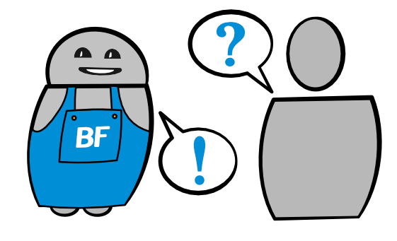
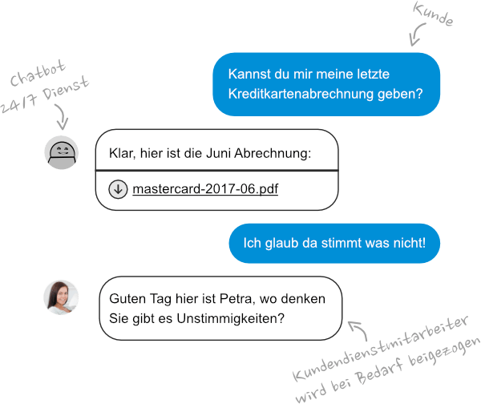

Unser Kundendienst Bot ist prädestiniert dafür, um Routinefragen zu beantworten. Er kann dies im Chat tun oder automatisiert E-Mails beantworten.

> ## Kurz erklärt, was unser Bot kann
>
> ### Triage
>
> Der Bot kann den Inhalt von Fragen erkennen und diese so priorisieren und zuteilen.
>
> ### Kundendienst-Antworten
>
> Der Bot beantwortet häufig wiederkehrende Fragen selbständig und zieht Mitarbeiter bei komplexen Fällen bei.
>
> ### Bestellung nachverfolgen
>
> Der Bot kann Käufer laufend über den Status einer Bestellung informieren.
>
> ### Aftersales
>
> Der Bot kann einen Käufer im Anschluss an die Lieferung nach der Zufriedenheit fragen und Support sowie Zusatzprodukte anbieten.

## Schnellere Hilfe für deine Kunden

Kundendienst-Bots beantworten die Fragen deiner Kunden innerhalb von Sekunden und dies rund um die Uhr.

Delegiere komplexe Kundenanliegen an deine Kundendienstmitarbeiter um die beste Benutzererfahrung zu erreichen.

## Beispiele

Bots sind dazu gemacht, Menschen bei repetitiven Prozessen zu unterstützen oder sie davon zu befreien. Deshalb bieten Bots gerade beim Beantworten von Fragen viele Möglichkeiten. Lass dich von den folgenden Beispielen inspirieren:

### Anfragen durch Bots zuteilen (Triage)

Die Triage eignet sich vor allem für E-Mail Anfragen. Der Bot erkennt den Inhalt einer Mitteilung dank modernsten Textanalyse-Algorithmen. Er kann die Anfrage nun je nach Thema an die entsprechende Person weiterleiten und ggf. bereits Vorschläge für die Antwort bereitstellen. Aufgrund des erkannten Inhaltes kann der Bot auch die Priorität einer Nachricht festlegen und als wichtig oder dringend erkannte Anfragen anders behandeln.

### Wiederkehrende Kundendienstanfragen automatisiert mit Bots beantworten

In der Masse gleichen sich die Anfragen an einen Kundendienst sehr: Passwort vergessen, Kontostand abfragen, Termin verschieben, Lieferdatum abklären, etc. Der Bot kann solche Anfragen nicht nur sortieren, sondern auch gleich selber beantworten. Dazu kann nötigenfalls auch festgelegt werden, zu welchem Zeitpunkt ein Bot die Antwort einem Menschen zur Prüfung weitergeben muss.

### Bestellung verfolgen

Hat der Bot einen offenen Kommunikationskanal zum Besteller, z.B. über den [Facebook-Messenger](https://www.botfabrik.ch/plattformen/), so kann er ihn über den Status seiner Bestellung auf dem Laufenden halten. Der Besteller selber kann auch Updates anfragen und die Lieferung noch beeinflussen indem der beispielsweise noch die Zustelladresse ändert.

### Aftersales aktivieren

Eine Zufriedenheitsumfrage kann durch einen Bot gesteuert werden. Dieser versendet nicht nur automatisch die Anfragen, sondern reagiert auch je nach Antwort mit entsprechenden Aktionen. So kann der Bots bei allfälligen Problemen Tutorials senden oder einen Mitarbeiter vom Support zuziehen. Der Bot kann dem Nutzer auch zusätzliche Tipps für eine bessere Nutzung des Produktes geben, oder Zubehör und Service-Pakete anbieten.

---

## Weitere Beispiele von Bots und Chatbots

### E-Commerce Bot

Unser E-Commerce eignet sich für Betreiber von Webshops und Webseiten, welche das Ziel haben, ihren Besuchern etwas zu verkaufen oder diese zu identifizieren.  
[Mehr erfahren](/e-commerce-bot/)

### Werbe Bots

Bots bieten gerade im Marketing unzählige Einsatzmöglichkeiten. Der Fantasie sind kaum Grenzen gesetzt.  
[Mehr erfahren](/werbe-bot/)

### Produktivitäts Bots

Unsere Produktivitäts-Bots helfen Ihnen wiederkehrende Abläufe effizienter zu organisieren, Fehler zu reduzieren und Mitarbeiter von Routinearbeiten zu entlasten.  
[Mehr erfahren](/produktivitaets-bot/)
