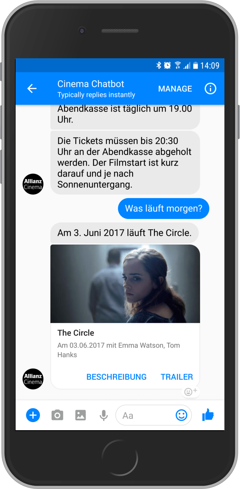
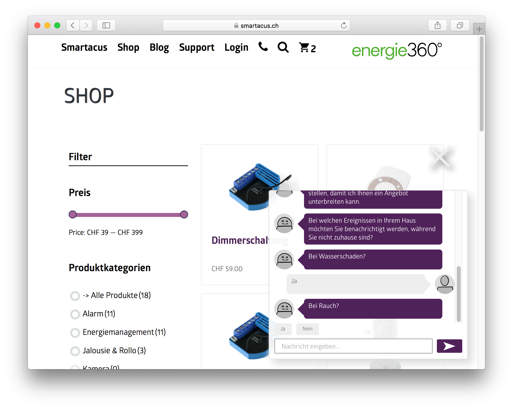
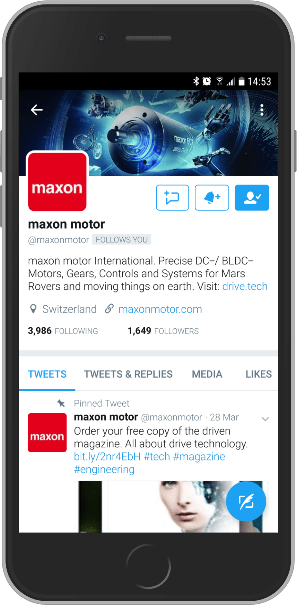

Eine Auswahl der Bots, welche erfolgreich in der Botfabrik aufgewachsen sind.

## Allianz Cinema Chatbot

Der Allianz Cinema Chatbot steht rund um das bekannte Open-Air Kino in Zürich und Basel zur Seite. Passend zu den Vorlieben des Besuchers werden Filme empfohlen und die entsprechenden Tickets angeboten. Zudem kann der Bot Fragen z.B. zum Programm, zur Witterung, zum Ticketkauf, zur Örtlichkeit usw. beantworten.

Der Bot verlost zudem jeden Tag selbständig Tickets. Dafür müssen die Besucher eine Frage des Bots zum Filmprogramm korrekt beantworten. Am Ende des Tages wählt der Bot eine Person zufällig aus, welche die Frage korrekt beantwortet hat.

Der Allianz Cinema Chatbot läuft auf Facebook Messenger und kann aus dem Web oder von Facebook aus direkt kontaktiert werden.

Für Unternehmen: **Allianz Suisse**

## Smartacus Chatbot

Der Smartacus Chatbot unterstützt die Besucher beim Einkaufen von Smarthome-Artikeln. Dies geschieht indem der Besucher einige Fragen des Bots beantwortet. Darauf hin stellt der Bot einen optimalen Warenkorb zusammen. Zudem beantwortet der Bot Fragen rund um das Thema Smarthome.

Falls der Chatbot einmal nicht weiter weiss und der Kunde dies wünscht, wird live eine Person aus dem Kundendienst von Energie 360° ins Gespräch eingebunden. So kann ein Besucher auch bei komplizierten Fragen direkt auf der Webseite zum Kunden werden.

Der Smartacus Chatbot läuft im Web. Der Kundendienst wird direkt mittels Slack eingebunden.

Für Unternehmen: **Energie 360° AG**

## Maxon Motor Twitter Bot

Der Maxon Motor Twitter Bot erhöht automatisch die Anzahl Follower von Maxon Motor auf Twitter.

Um dies zu erreichen folgt der Bot Personen deren Tweets bestimmt Keywords enthalten. Danach folgen diese Person oft der Maxon Motor zurück.

Für Unternehmen: **Maxon Motor AG**
