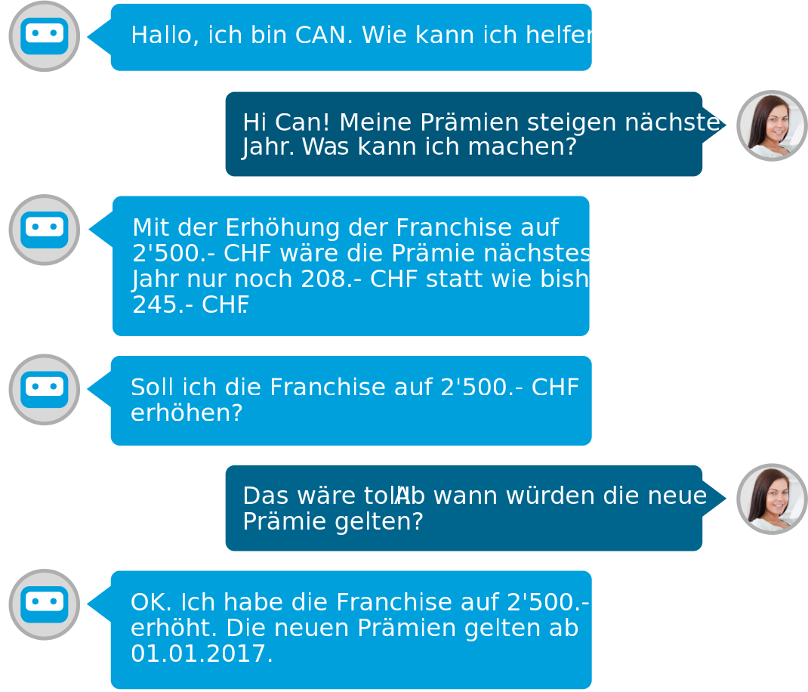
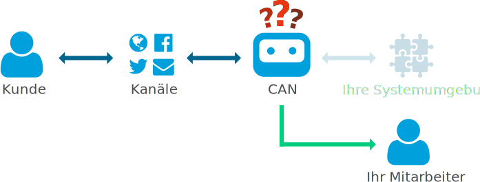

## Was ist CAN

CAN steht für **C**ustomer **A**ssisting **N**eural-network und ist ein intelligenter Bot der ähnlich einer Person im Kundendienst auf die Bedürfnisse Ihrer Kunden eingehen kann. CAN nimmt auf den wichtigsten digitalen Kanälen die Anfragen der Kunden entgegen und steht mit Rat und Tat zur Seite.

CAN kann für unterschiedliche Bedürfnisse im Kundendienst eingesetzt werden:

- Unterstützung
- Information
- Reklamation
- Reparatur
- Wartung

## Ihre Vorteile

Mit CAN profitieren Sie von einer ganzen Reihe von Vorteilen:

### Extrem schnelle Reaktionszeiten

CAN antwortet durchschnittlich in unter 5 Sekunden. Somit erhalten Ihre Kunden praktisch in Echtzeit ein Feedback.

### 24h

CAN steht Ihren Kunden zu jeder Tages- und Nachtzeit zur Verfügung.

### Zuvorkommend

CAN hat immer gute Laune und ist sich für keine Aufgabe zu schade. Er ist äusserst zuvorkommend und steht Ihren Kunden in vielen Situation zur Seite.

### Tiefe Kosten

Mit CAN können Sie mehr Anfragen mit weniger Personal bewältigen.

## Branchen

CAN ist für den Kundendienst in folgenden Branchen ausgelegt und optimiert:

- Versicherung
- Bank
- Handel
- IT
- Gesundheitswesen

## Wie funktio­niert CAN

CAN wird zwischen Ihre Systemumgebung und Ihren digitalen Kanälen geschaltet.

CAN muss nicht auf alles eine Antwort haben, um Sie zu unterstützen. Wenn CAN einmal nicht weiter weiss, so schickt er die Anfrage an die verantwortlichen Mitarbeiter weiter und informiert den Kunden darüber.

CAN setzt auf vier Komponenten auf um die Kunden vollumfänglich zu unterstützten:

### Neuronales Netz

CAN entscheidet mit Hilfe eines neuronalen Netzes was die Absicht des Kunden ist. Je mehr Trainingsdaten CAN zur Verfügung stehen, um so besser sind seine Entscheidungen. Trainingsdaten können z.B. klassifizierte E-Mails oder bestehende Chat-Verläufe sein.

### Hinterlegte Prozess­schritte

Jede Absicht bedarf einer speziellen Schrittfolge die CAN mit den Kunden durchgeht. Hat der Kunde z.B. ein defektes Geräte, so sind andere Schritte notwendig als bei Fragen zur aktuellen Rechnung.

### Massgeschneiderte Logik

CAN ist in dem Sinn speziell, dass er die Kunden nicht bloss informiert, sondern auch tätig wird. So kann CAN z.B. Adressen ändern oder Leistungen anpassen. Dazu wird je nach Tätigkeitsschritt massgeschneiderte Logik ausgeführt.

### Integriert in Ihre Systemumgebung

Je besser CAN in Ihre Systemumgebung integriert ist, um so besser kann CAN dem Kunden zur Seite stehen. CAN kann mit den Kunden über den Versandstatus, offene Rechnungen oder Kontendaten sprechen, wenn er Zugriff auf die entsprechende Systeme hat.

## Digitale Kanäle

Verbinden Sie CAN mit den Plattformen,  
wo Sie Kontakt mit Ihren Kunden pflegen,  
damit CAN Ihre Kunden unterstützen kann.

### Ihre Webseite

Ist CAN auf Ihrer Unternehmens-Webseite eingebunden, so kann er Ihre Besucher und Kunden auf Ihrer eigenen Webseite unterstützen.

### Twitter

Ist CAN mit Ihrem Twitter-Kanal verbunden, so kann er Ihre Follower unterstützen.

### Facebook

Ist CAN mit Ihrem Facebook-Seite verbunden, so kann er Ihre Fans unterstützen.

### Mail

Ist CAN mit Ihrem E-Mail-Konto verbunden, so kann er Sie beim Beantworten von Mails unterstützen.

## Jetzt Profitieren

Profitieren Sie von höheren Reaktionszeiten und kleineren Aufwänden im Kundendienst mit CAN. Melden Sie sich noch heute für die CAN-Beta an und Sie werden kontaktiert, sobald CAN für Sie bereit ist.
