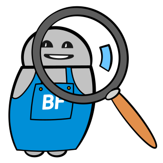

## Fragen, Chancen und Strategien rundum Chatbots

Die Botfabrik bietet neu den kostenlosen Chatbot-Check an. Der Chatbot-Check ist für Dich, wenn Du:

- Fragen zu Chatbots hast
- Wissen möchtest, wie Chatbots Euch unterstützen können
- Eine Idee im Bereich Chatbots mit einem Experten besprechen möchtest

Wir haben mit der Entwicklung und dem Betrieb von Chatbots bereits über zwei Jahre Erfahrung. Zudem hat die Botfabrik Chatbot-Projekte in ganz unterschiedlichen Bereichen und Umgebungen umgesetzt. Entsprechend haben wir Zugriff auf einen grossen Erfahrungsschatz.

Unsere Experten kommen gerne bei Dir vorbei oder stehen telefonisch zur Verfügung um Deine Fragen zu klären.

## Wir klären im Chatbot-Check

- Was Chatbots sind
- Einsatzgebiete für Chatbots
- Was für Chancen sich mit Chatbots eröffnen
- Wie Chatbots optimal einsetzen
- Was mit Chatbots möglich ist
- Ideen für eine Chatbot-Strategie

Falls Du nach unserem Gespräch Bedarf an einem Chatbot feststellst, arbeiten wir gerne mit Dir an dessen Umsetzung.

## Jetzt den Chatbot-Check machen

Melde dich bei uns per Telefon, Mail oder per Chat um dem perfekten Chatbot einen Schritt näher zu kommen.
