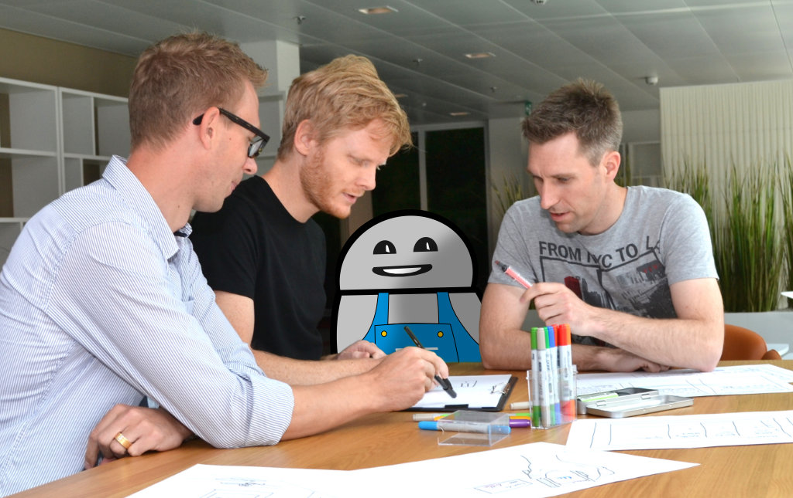
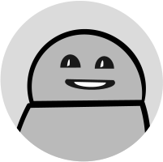

In der Botfabrik entwickeln wir kundenindividuelle Bots und Chatbots und integrieren diese bei Bedarf in die bestehende IT Struktur. Wir sind zu 100% unabhängig und können somit die Tools und Technologien einsetzen, die die geforderten Anforderungen und Ziele ideal erfüllen.

Das Kernteam der Botfabrik besteht aus Linus, Philip, Roman, Markus und unserem Fabrik-Bot Pit.

Zu unseren Kompetenzen gehören

- die Konzeption von Software
- die hohe Usability und ansprechendes Design
- die Software-Architektur und -Entwicklung

Bots sind unser aller Leidenschaft und wir freuen uns über jeden Tag, an dem wir Bots entwickeln dürfen.

## Kontakt

Wir sind immer interessiert am Austausch, deshalb zögere nicht mit uns in Kontakt zu treten.

<a class="negative-btn-block chatbot-action" data-chatbot-message="Ich habe Interesse an einem Bot">  
  
via Pit
</a>

[mensch@​botfabrik.ch](mailto:mensch@botfabrik.ch)

[+41 41 322 26 26](tel:+41413222626)

## Standort

Die Botfabrik befindet sich in Sempach an der Autobahn A2 und der Bahnlinie zwischen Luzern und Sursee.

Neuenkirchstrasse 19  
6203 Sempach Station

<iframe frameborder="0" height="550px" marginheight="0" marginwidth="0" scrolling="no" src="https://maps.google.com/maps?q=Apptiva%20AG,%20Neuenkirchstrasse%2019,%20Sempach%20Station&hl=de&geocode=+&hnear=Apptiva%20AG+Neuenkirchstrasse%2019,+Sempach%20Station&t=m&z=10&iwloc=A&output=embed" width="100%"></iframe>
