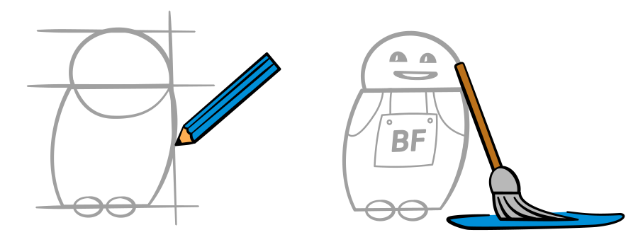

In der Botfabrik werden Strategien für Bots und Chatbots ausgeheckt, entsprechende Konzepte erstellt und schliesslich entwickelt.  Ein Bot ist ein intelligenter kleiner Helfer, welcher Tag und Nacht für dich Arbeit verrichtet. Manche Dinge macht er im Hintergrund, aber häufig kommt er direkt auf dich und deine Kunden zu, um zu helfen.

## Auswahl unserer Kunden

## Jetzt Kontakt aufnehmen

Bist du auf der Suche nach einem passenden Bot der für dich Arbeitet?  
Benötigst du Unterstützung bei der Entwicklung eines Chatbots?  
Oder möchtest du dich einfach über ein sehr spannendes Thema austauschen?

Nimm mit uns Kontakt auf:

Es gibt unzählige Varianten von Bots, die deinen Alltag vereinfachen können. In der Botfabrik programmieren wir zum Beispiel die folgenden Exemplare:

### E-Commerce Bot

Unser E-Commerce eignet sich für Betreiber von Webshops und Webseiten, welche das Ziel haben, ihren Besuchern etwas zu verkaufen oder diese zu identifizieren.  
[Mehr erfahren](https://www.botfabrik.ch/e-commerce-bot/)

### Kundendienst Bot

Unser Kundendienst Bot ist prädestiniert dafür, um Routinefragen zu beantworten. Er kann dies im Chat tun oder automatisiert E-Mails beantworten.  
[Mehr erfahren](http://www.botfabrik.ch/kundendienst-bot/)

### Werbe Bots

Bots bieten gerade im Marketing unzählige Einsatzmöglichkeiten. Der Fantasie sind kaum Grenzen gesetzt.  
[Mehr erfahren](http://www.botfabrik.ch/werbe-bot/)

### Produktivitäts Bots

Unsere Produktivitäts-Bots helfen Ihnen wiederkehrende Abläufe effizienter zu organisieren, Fehler zu reduzieren und Mitarbeiter von Routinearbeiten zu entlasten.  
[Mehr erfahren](https://www.botfabrik.ch/produktivitaets-bot/)

## [Botfabrik Blog](https://www.botfabrik.ch/blog/)

Interessante Einblicke zur Entwicklung von Bots und Chatbots.
[Zum Blog](https://www.botfabrik.ch/blog/)
