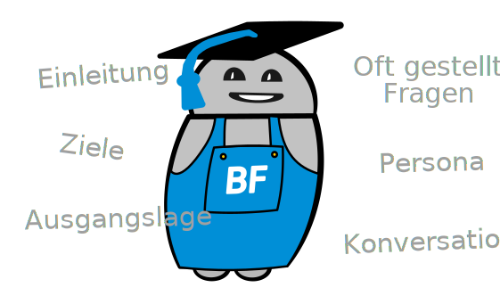

Chatbots liegen im Trend. Doch was genau ist eigentlich ein Chatbot und wie könnte ein Chatbot in deinem Unternehmen von Nutzen sein? Ist das alles nur Hype oder steckt da auch wirklich was dahinter? In unserem Workshop “Kennenlern-AngeBot” durchleuchten wir diese Fragen und erarbeiten mit deinem Team zusammen einen lauffähigen Chatbot, der in dein Unternehmen passt.

## Ablauf des Workshop

Wir führen den Workshop bei dir in der Firma durch. Damit erhalten wir einen besseren Einblick in den künftigen Arbeitsplatz deines neuen virtuellen Mitarbeiters. Es macht Sinn, dass von deiner Firma drei bis vier Personen aus einer Fachabteilung, sowie eine Person aus der IT am Workshop teilnehmen. Der Workshop dauert rund vier Stunden und setzt sich aus folgenden Teilen zusammen:

### Einleitung

Wir machen eine kurze Einleitung ins Thema Chatbot. Dabei erklären wir, was Chatbots sind, wo sie eingesetzt werden können und wie die aktuellen Trends aussehen.

### Ziele

Zusammen blicken wir in die Zukunft und gehen davon aus, dass euer Chatbot bereits seit einem Jahr im Einsatz ist. Was hat sich für eure Mitarbeiter dadurch geändert? Was hat sich für eure Kunden und Lieferanten geändert?  
Basierend auf diesen Inputs leiten wir Ziele ab, die der Chatbot erreichen soll.

### Ausgangslage

Über welche Kanäle (z.B. E-Mail, Telefon) gelangen Anfragen ans Team?  
Welche Quellen könnten heute schon genutzt werden, um die Fragen zu beantworten?  
Was funktioniert gut und wo gibt es evtl. Verbesserungsbedarf?

### Oft gestellte Fragen

Chatbots können sich dort so richtig entfalten, wo es wiederkehrende Anfragen zu erledigen gibt. Dies können zum Beispiel Fragen von Mitarbeitern an die HR Abteilung sein, Fragen von Kunden, Lieferanten oder von Besuchern eurer Webseite.  
Wir sammeln die am meisten gestellten Fragen. Diese soll der Chatbot später eigenständig beantworten können.

### Chatbot Persona

Wir wollen dem Chatbot eine Identität geben, die zur Firma passt. Wie soll der Chatbot heissen? Ist er weiblich, männlich oder geschlechtslos? Spricht er in der Höflichkeitsform oder darf er seinen Chatpartner duzen? Soll er etwas Humor zeigen oder eher trocken daherkommen? Was für eine Persönlichkeit soll der Chatbot verkörpern? Gibt es vielleicht schon Vorstellungen, wie sein Avatar auszusehen hat?

### Konversationen

Jetzt wo wir wissen, welche Fragen der Chatbot selber beantworten soll und seine Identität kennen, beginnen wir mit der Ausarbeitung der Konversationen. In kleinen Gruppen werden dieselben Themen bearbeitet. Dadurch wird es eine gewisse Varianz in den Konversationen geben, mit welcher der Chatbot umgehen können muss. Wir werden dafür sorgen, dass er dies auch tatsächlich kann.

### Rückblick

Zum Abschluss des Workshops sichten wir nochmals kurz die Arbeitsresultate der vorherigen Schritte und machen uns Gedanken zum weiteren Vorgehen. Als Zückerchen präsentieren wir den soeben geborenen Chatbot, der bereits einige der oft gestellten Fragen beantworten kann.  
Natürlich interessiert uns in diesem Schritt auch, wie der Workshop bei den anwesenden Personen angekommen ist. Was war gut, was kann besser oder anders sein?

## Jetzt Termin buchen

Konnten wir dein Interesse wecken? Kontaktiere uns um gleich einen Termin zu vereinbaren. Die vier Stunden werden sich lohnen, denn du wirst Klarheit über den Sinn eines Chatbots für dein Unternehmen erhalten.
