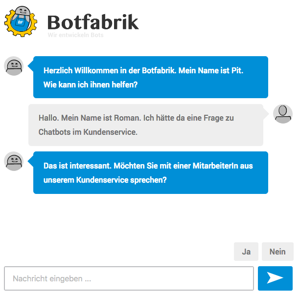
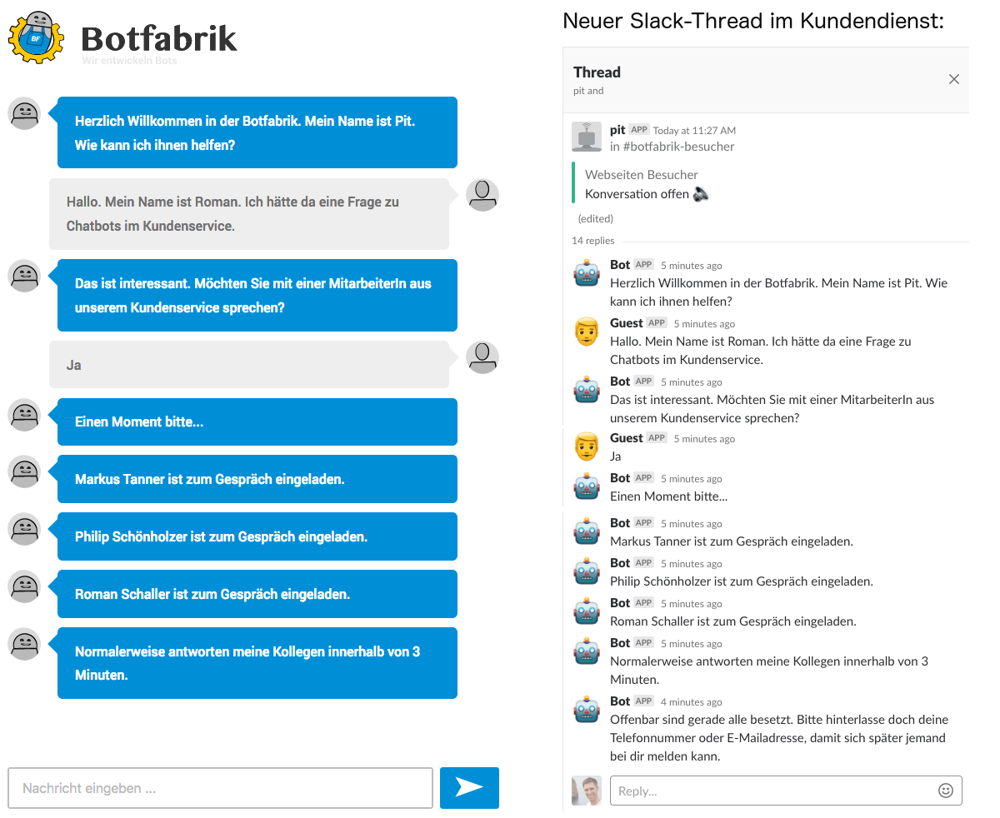
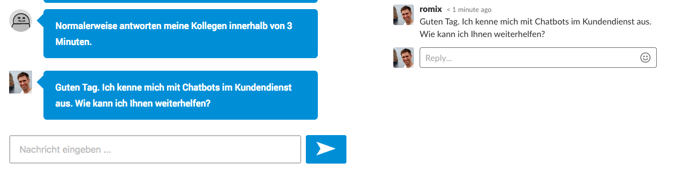
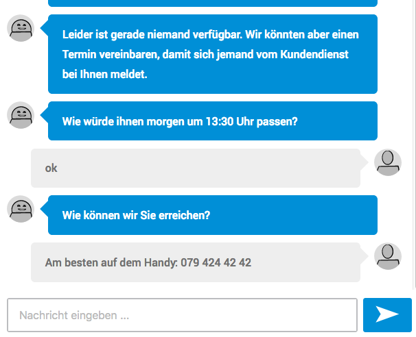

# Ein Chatbot am Empfang

Chatbots eignen sich gut, um Kunden zu begrüssen und an die richtige Stelle weiterzuleiten. An Randzeiten am Abend oder am Wochenende
kann der Chatbot stattdessen einen Termin vereinbaren. Wir zeigen hier, wie das im Detail funktioniert und was das für den Kunden und
den Kundendienst bedeutet.

Unsere Chatbots sind oft in Webseiten eingebunden. Dort erscheint meist rechts unten ein kleines Chatsymbol. Wenn man auf das Symbol klickt, wird
man freundlich begrüsst. Kunden können dann in diesem Chat ihr Anliegen anbringen:

Nun hat der Kunde die Möglichkeit, mit dem Kundendienst Kontakt aufzunehmen. Falls er die Frage mit "Ja" beantwortet, tritt der Chatbot
wieder in Aktion. Er schaut nun nach, ob auch tatsächlich jemand verfügbar ist. Wir setzen als Anwendung für den Kundendienst oft
[Slack](https://slack.com/) ein. Es sind aber auch viele andere Anwendungen dazu geeignet. Im Falle von Slack schaut sich unser
Chatbot nun die aktiven Benutzer eines bestimmten Kanals an:

Mac, philip und romix sind online. Unser Chatbot lädt diese drei Benutzer zum Chat ein und notifiziert sie. So wissen sie gleich,
dass auf der Webseite jemand um Rat bittet. Linus ist nicht online, er wird somit auch nicht eingeladen. Dem Kunden wird nun
gezeigt, dass er mit dem Kundendienst verbunden ist. Gleichzeitig wird im Hintergrund eine neue Konversation erstellt mit allem, was
der Kundendienst wissen muss. Insbesondere dem bisherigen Chatverlauf:

Schreibt nun Roman Schaller vom Kundendienst, erscheint die Nachricht direkt im Chatfenster des Kunden:

Nun kommt es oft vor, dass potentielle Kunden sich dann melden, wenn gerade niemand online ist. Idealerweise kann ein Chatbot dann
die wichtigsten Fragen schon selber beantworten. Wenn er aber nicht mehr weiter weiss, kann er mit dem Kunden auch einen Termin
vereinbaren, damit sich der Kundendienst zu Geschäftszeiten wieder bei ihm meldet.

